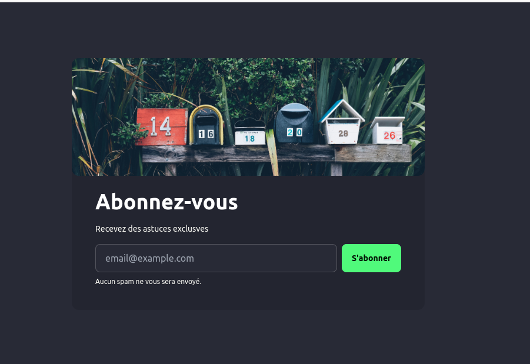

# Newsletter Subscription App

Ce projet est une application Next.js permettant aux utilisateurs de s'inscrire à une newsletter en utilisant Mailchimp. Il est conçu avec Tailwind CSS et DaisyUI pour le style, et utilise React Toastify pour afficher les notifications.




## 🚀 Technologies utilisées

- **Next.js** – Framework React pour les applications web modernes
- **TypeScript** – Typage statique pour un code plus robuste
- **Tailwind CSS** – Framework CSS utilitaire
- **DaisyUI** – Composants UI basés sur Tailwind CSS
- **React Toastify** – Notifications utilisateur
- **Mailchimp API** – Gestion des abonnements à la newsletter

## 📂 Structure du projet

```
├── src/
│   ├── app/
│   │   ├── api/
│   │   │   └── subscribe/route.ts  # Route API pour l'inscription
│   │   ├── layout.tsx             # Layout global
│   │   ├── page.tsx               # Page principale
│   ├
│   ├
│   ├── styles/                     # Fichiers de style globaux
│   └── tailwind.config.ts          # Configuration Tailwind CSS
├── public/
│   └── backNewsletter.jpg         # Image de fond du formulaire
├── .env                            # Variables d'environnement (non suivi par Git)
├── README.md                       # Documentation du projet
├── package.json                     # Dépendances du projet
└── tsconfig.json                    # Configuration TypeScript
```

## 📌 Prérequis

Avant de commencer, assure-toi d'avoir installé :
- [Node.js](https://nodejs.org/) (v18+ recommandé)
- Un compte Mailchimp et une clé API

## ⚙️ Installation

Clone le projet :
```bash
git clone https://github.com/Lyrecoph/newsletterApp.git
cd newsletterApp
```

Installe les dépendances :
```bash
npm install
# ou
yarn install
```

## 🔧 Configuration

Crée un fichier `.env.local` à la racine du projet et ajoute les variables d'environnement :
```env
MAILCHIMP_API_KEY=your-api-key
MAILCHIMP_API_SERVER=your-server-prefix
MAILCHIMP_AUDIENCE_ID=your-audience-id
```

## 🚀 Lancement du projet

Démarrer le serveur de développement :
```bash
npm run dev
# ou
yarn dev
```

Le projet sera accessible sur `http://localhost:3000`

## 📡 Déploiement

Tu peux déployer ce projet sur [Vercel](https://vercel.com/) :
```bash
npm run build
npm run start
```

## 📢 Fonctionnalités

- ✅ Formulaire d'inscription à la newsletter
- ✅ Envoi des emails via Mailchimp
- ✅ Notifications avec React Toastify
- ✅ Interface utilisateur moderne avec DaisyUI

## 🛠 Améliorations possibles

- ✅ Validation avancée des emails
- ✅ Ajout d'une confirmation d'inscription
- ✅ Gestion d'erreurs plus détaillée

## 🤝 Contribution

Les contributions sont les bienvenues !

1. Fork le projet
2. Crée une branche : `git checkout -b feature-nom`
3. Commits tes modifications : `git commit -m 'Ajout d'une nouvelle fonctionnalité'`
4. Pousse la branche : `git push origin feature-nom`
5. Ouvre une Pull Request

## 📜 Licence

Ce projet est sous licence MIT. Voir le fichier [LICENSE](LICENSE) pour plus d’informations.

---

✨ _N'hésite pas à laisser une étoile ⭐ sur le repo si ce projet t'a aidé !_

